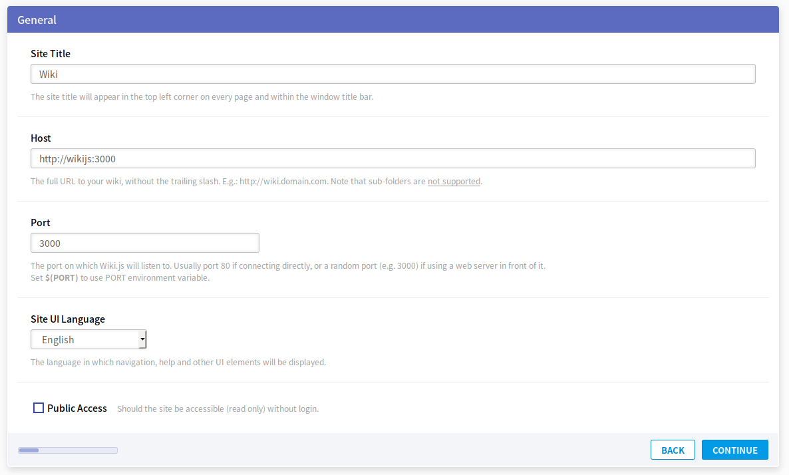
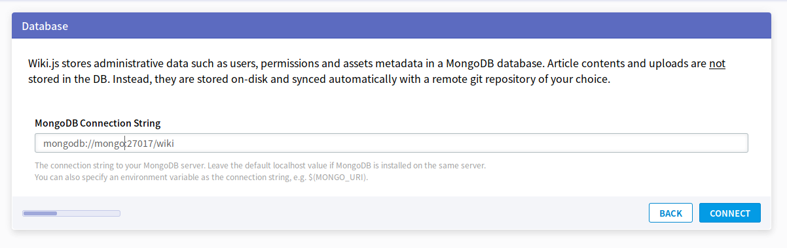
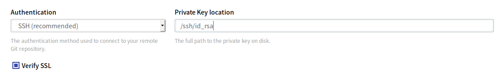
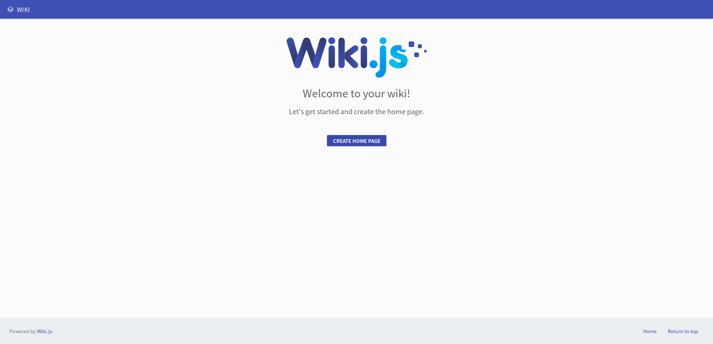

# Setup

1. 在`.wikijs`目錄下執行

    ```bash
    curl -sSo- https://wiki.js.org/install.sh | bash
    ```
2. 修改`docker-compose.yml`如下:

    ```yml
    wikijs:
      build: ./build/wikijs
      entrypoint: node wiki configure
      volumes:
        - ./wikijs:/wikijs
        - ~/.ssh:/ssh
    ```

3. `docker-compose up --build`
4. Host和Port依照下圖設定，其他隨意:

    

5. Database 依照下圖設定

    

6. 在`docker-compose.yml`中設定mapping包含ssh private key的目錄(默認`~/.ssh`)到wikijs容器的`/ssh`中，其中假設`id_rsa`是我用來存取github的privte key:

    

7. 將第2.步驟的`entrypoint`那一行拿掉，然後執行`docker-compose up --build`，連線到`http://localshot:3000`，顯示如下畫面就表示成功

    

